# JiraTech — Application Guide

JiraTech is a Jira-style application lifecycle management (ALM) platform. Teams use it to track work in projects (stories, tasks, defects, epics), move that work through configurable workflows, search it with JQL, plan it into program increments, and report on it.

On top of the standard Jira-style features, JiraTech supports the **SPORTS conventions**: a strict issue hierarchy, SPORTS-specific issue types (Feature/BAU/Release epics, release candidates, code/test/deployment sub-tasks), team and service component naming rules, RAG status, incident escalation and PI scheduling.

> Screenshots in this guide were taken from a local instance loaded with the demo data (`npm run db:seed:demo`), logged in as `admin@jiratech.local`.

---

## Contents

1. [Architecture at a glance](#1-architecture-at-a-glance)
2. [Core concepts](#2-core-concepts)
3. [Signing in](#3-signing-in)
4. [The global header](#4-the-global-header)
5. [Board](#5-board)
6. [Creating issues](#6-creating-issues)
7. [Issues: search, JQL, filters and bulk changes](#7-issues-search-jql-filters-and-bulk-changes)
8. [Issue detail](#8-issue-detail)
9. [SPORTS features on an issue: RAG, custom fields, incidents, releases](#9-sports-features-on-an-issue)
10. [Projects](#10-projects)
11. [Project settings: versions, components, workflow, people](#11-project-settings)
12. [Planning (program increments)](#12-planning-program-increments)
13. [Dashboard](#13-dashboard)
14. [Reports](#14-reports)
15. [People](#15-people)
16. [Notifications and email](#16-notifications-and-email)
17. [Permissions reference](#17-permissions-reference)
18. [JQL reference](#18-jql-reference)
19. [Capabilities available through the API only](#19-capabilities-available-through-the-api-only)
20. [Screen index](#20-screen-index)

---

## 1. Architecture at a glance

| Layer | Technology | Notes |
|---|---|---|
| Frontend | React, Vite, TypeScript, Tailwind CSS, TanStack Query | Single-page app on port **5173** |
| Backend | NestJS (REST API under `/api`) | Port **3000** |
| Database | Prisma ORM with **SQLite** (default) or **PostgreSQL** | Chosen by `DATABASE_URL` in `backend/.env` |
| Auth | JWT (bearer token, 7-day expiry by default) | Token stored in the browser |
| Email | SMTP, or `.eml` files in `backend/mail-outbox/` when no SMTP host is set | |
| PDF | jsPDF, generated in the browser | Used by Reports |

Each backend module maps to a feature area: `auth`, `projects`, `issues` (incl. bulk), `workflow`, `search` (JQL), `board`, `comments/history/links` (in issues), `notifications`, `versions`, `components`, `labels`, `custom-fields`, `planning`, `scheduling`, `releases`, `incidents`, `dashboard`, `reports`, `users`, `access` (project permissions).

Project-scoped requests carry the current project in the `X-Project-Key` header, so every screen works on the project selected in the header.

---

## 2. Core concepts

**Project** — a container for issues, with a unique key (`PAY`, `MOB`, `SPORTS`). Issues are numbered `KEY-1`, `KEY-2`, … Every project has its own versions, components, custom fields, workflow and members.

**Project types**
- *Standard* — free hierarchy and free component naming.
- *SPORTS conventions* — ticked at creation ("Enforce SPORTS conventions"). Stories, tasks and defects must sit under an epic, and components must follow the naming rules (team components start with `@`, service / release-train components use `ASSETID (serviceName)`).

**Issue types and hierarchy**

| Level | Types |
|---|---|
| Epics (top level) | Epic, Feature Epic, BAU Epic, Release Epic |
| Level 2 | Story, Defect, Task, Release Candidate |
| Sub-tasks | Analysis, Bug Fix, Code, Code Review, Arch Review, Code Merge, Documentation, Test Case, Test Run, Deployment, Configuration, Sub-task |

Parent rules are enforced by the server — for example, a *Release Candidate* can only sit under a *Release Epic*, *Code* only under a *Story*, and a *Defect* can sit under an epic or a story. A child issue is always created in its parent's project.

**Statuses and categories** — each project's workflow has its own statuses (e.g. *In Review*, *QA*), and every status belongs to one of four categories: **Backlog, To Do, In Progress, Done**. Dashboards, reports and the `statusCategory` JQL field use the category. New projects start with Backlog → To Do → In Progress → Closed.

**Resolution** — moving an issue into a Done status requires a resolution (*Done* or *Won't do*). Re-opening clears it.

**Priority** — Highest, High, Medium, Low, Lowest. For defects, the SPORTS rules derive priority from a severity × impact matrix.

---

## 3. Signing in

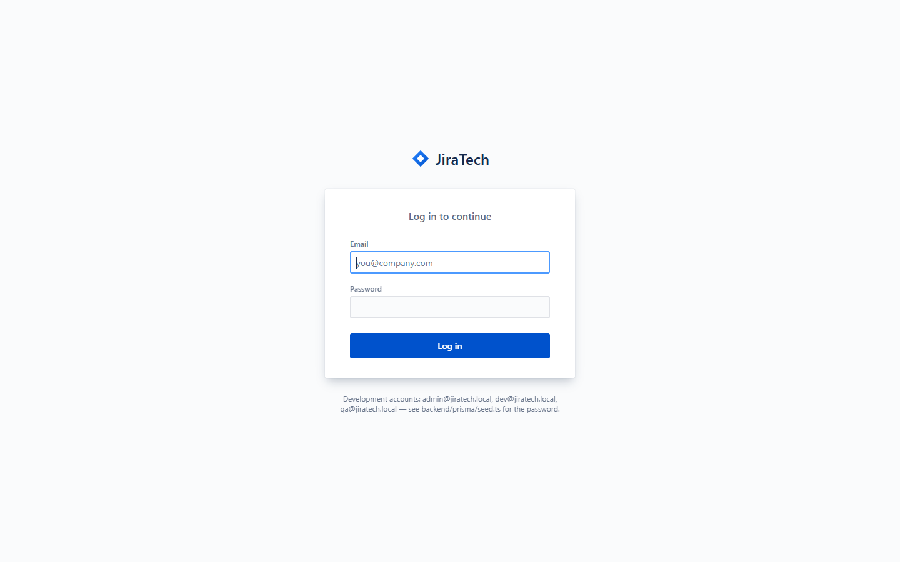

Sign in with email and password. A successful login stores a JWT in the browser; signing out (account menu) clears it. Accounts are created by an administrator on the **People** page — there is no self-registration.

Default administrator: `admin@jiratech.local` / `admin123`. Demo users (after `db:seed:demo`) share the same password, e.g. `elena@` (team lead), `nikos@` (developer), `sofia@` (QA), `daniel@` (release manager), `katerina@` (product owner).

---

## 4. The global header

Every page shares one header with:

| Element | What it does |
|---|---|
| **Logo** | Back to the board |
| **Project switcher** | Shows the current project; switches project, links to all projects or *Create project* |
| **Navigation** | Board · Issues · Projects · Planning · Dashboards · Reports · People |
| **Create** | Opens the Create issue dialog |
| **Search** | Quick search across issues and projects (press `/` from anywhere) |
| **Bell** | Notifications, with an unread badge (refreshes every 30 s) |
| **Avatar** | Account menu: name and role, *Email notifications* switch, *Log out* |

**Project switcher**

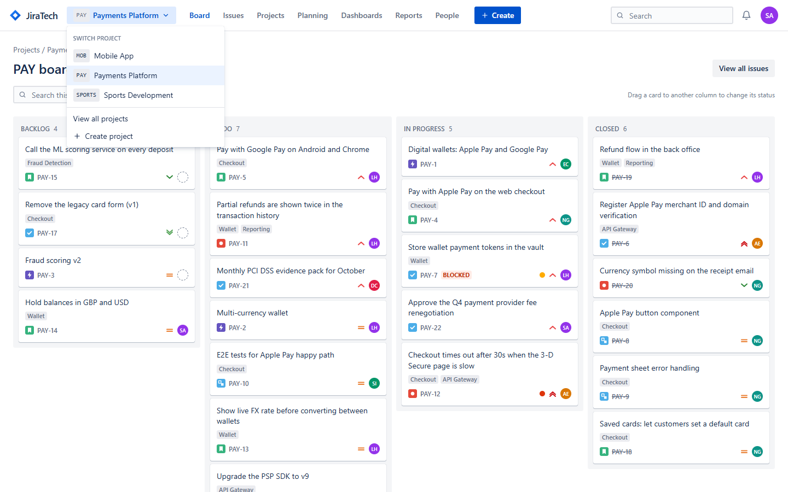

**Quick search** — type a key or words; matching issues appear as you type, and *Search all issues for "…"* opens the full Issues page with that text.

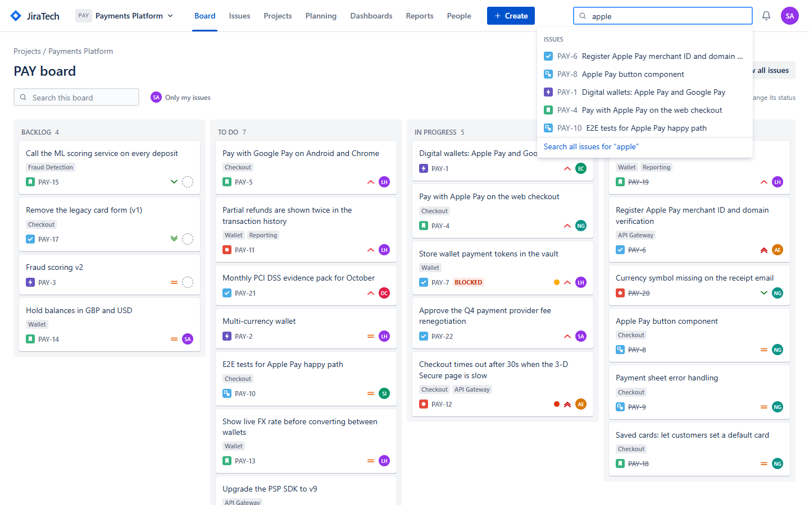

**Account menu** — turn email notifications on or off (in-app notifications are always on).

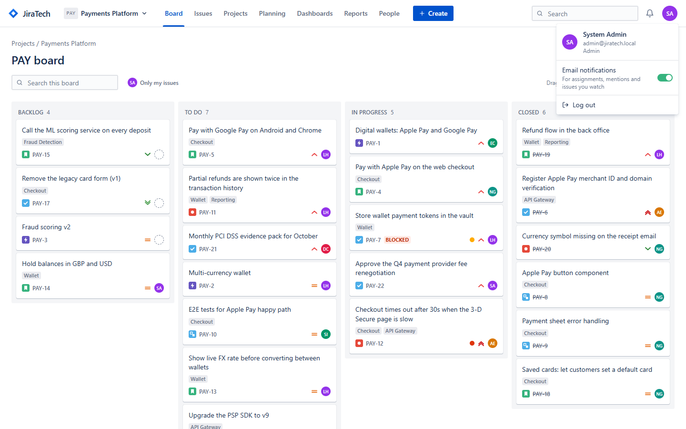

---

## 5. Board

The home page is the Kanban board of the current project.

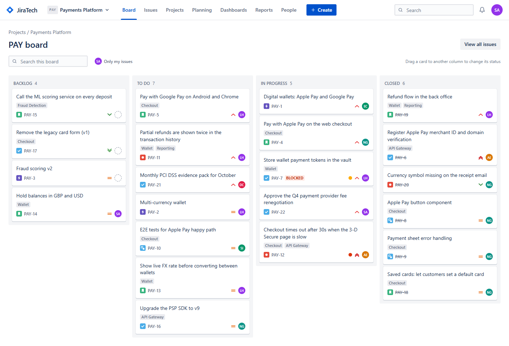

- One column per workflow status, with a count in each header.
- Each card shows summary, components, issue type icon, key, priority icon, assignee avatar, and a **BLOCKED** flag or RAG dot when set. Closed issues have their key struck through.
- **Drag a card to another column** to change its status. Only moves allowed by the workflow are accepted; dropping into a Done column asks for a resolution first.
- **Search this board** filters cards by text; **Only my issues** shows issues assigned to you.
- **View all issues** opens the Issues page for the project.

The SPORTS board looks the same, but with the SPORTS issue types and @team components:

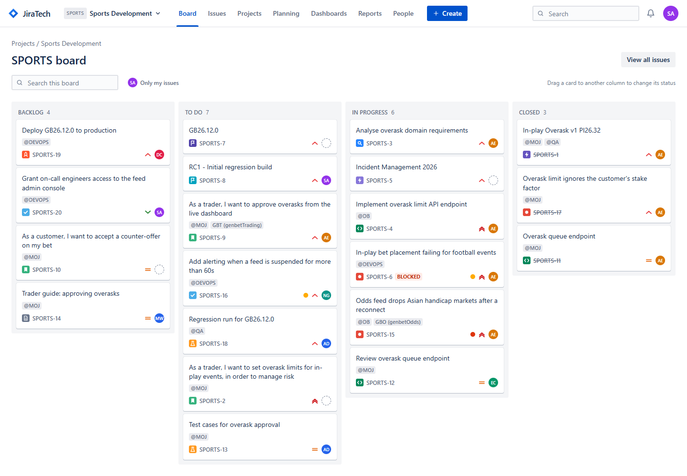

---

## 6. Creating issues

Click **Create** in the header (or *Add child issue* / *Create sub-task* from an issue).

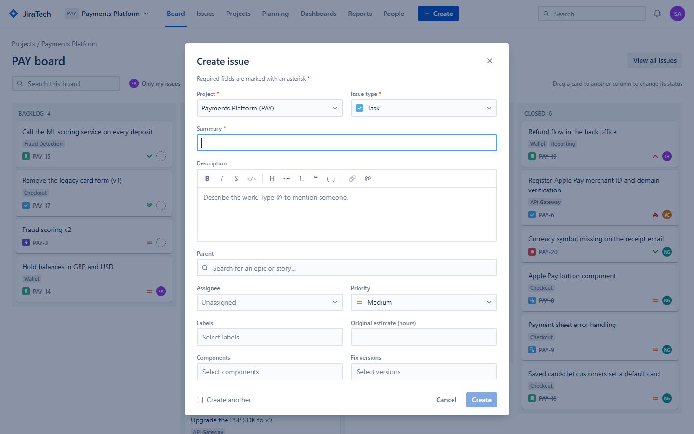

| Field | Notes |
|---|---|
| Project \* | Only projects where you are a Member or Administrator |
| Issue type \* | All types; the list of valid parents depends on the type |
| Summary \* | |
| Epic name | Shown for epic types |
| Description | Rich text: bold, italic, strikethrough, inline code, heading, lists, quote, code block, link, `@` mention |
| Parent | Type-ahead search for an epic or story. Required in SPORTS-convention projects for level-2 types |
| Assignee, Priority | Priority defaults to Medium |
| Labels | Pick existing labels or create new ones inline |
| Original estimate (hours) | Used by time tracking and the PI scheduler |
| Components, Fix versions | From the project's settings |
| Create another | Keeps the dialog open for the next issue |

Mentioning someone with `@` in the description notifies them and adds them as a watcher.

---

## 7. Issues: search, JQL, filters and bulk changes

The **Issues** page is the search hub.

### Basic search

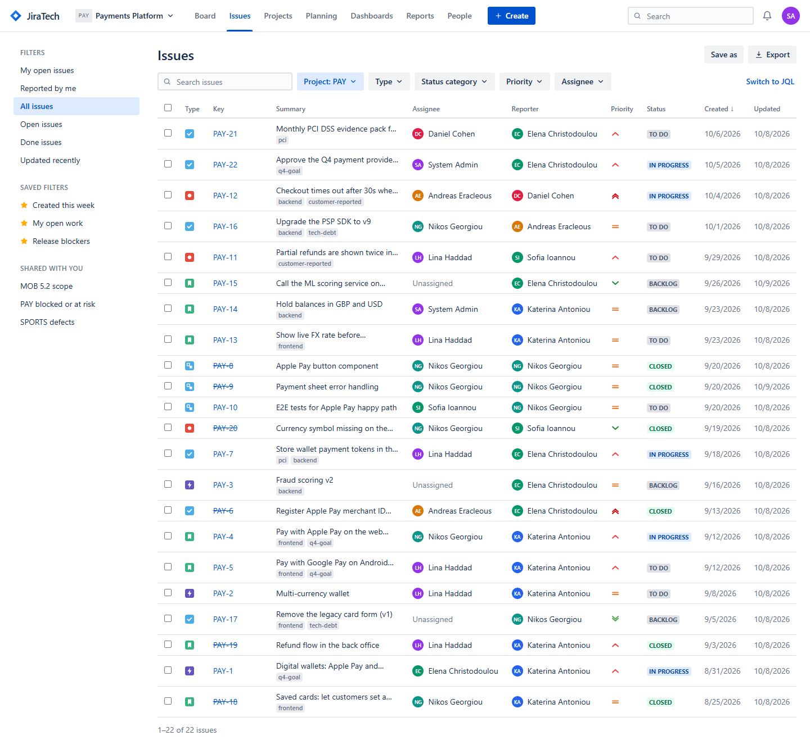

Filter by text, project, type, status, assignee and other dropdowns. The left sidebar holds:
- **Filters** — built-in: My open issues, Reported by me, All issues, Open issues, Done issues, Updated recently.
- **Saved filters** — your own (starred).
- **Shared with you** — filters other people have shared.

### JQL search

Click **Switch to JQL** to write queries directly. The help line under the box lists fields, operators, functions and date formats.

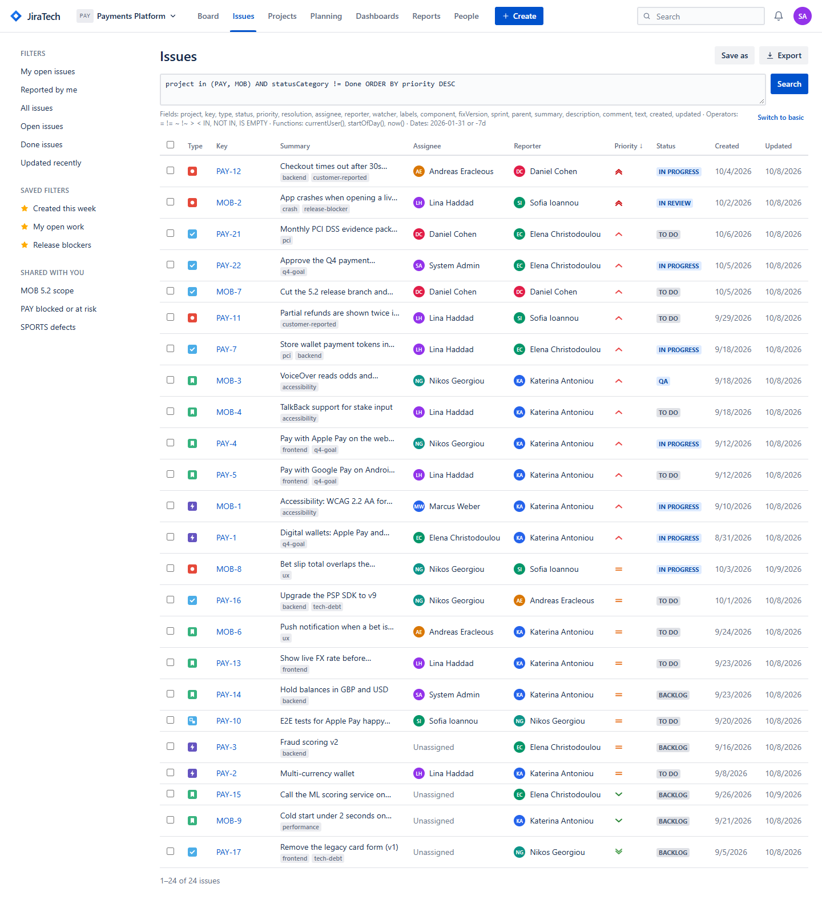

- Click column headers to sort; results are paged.
- **Save as** stores the query as a saved filter, optionally shared.
- **Export** downloads the results as CSV.
- Search results only include issues you're allowed to see.

### Bulk changes

Tick issues (or the header checkbox for the whole page) to get the bulk toolbar.

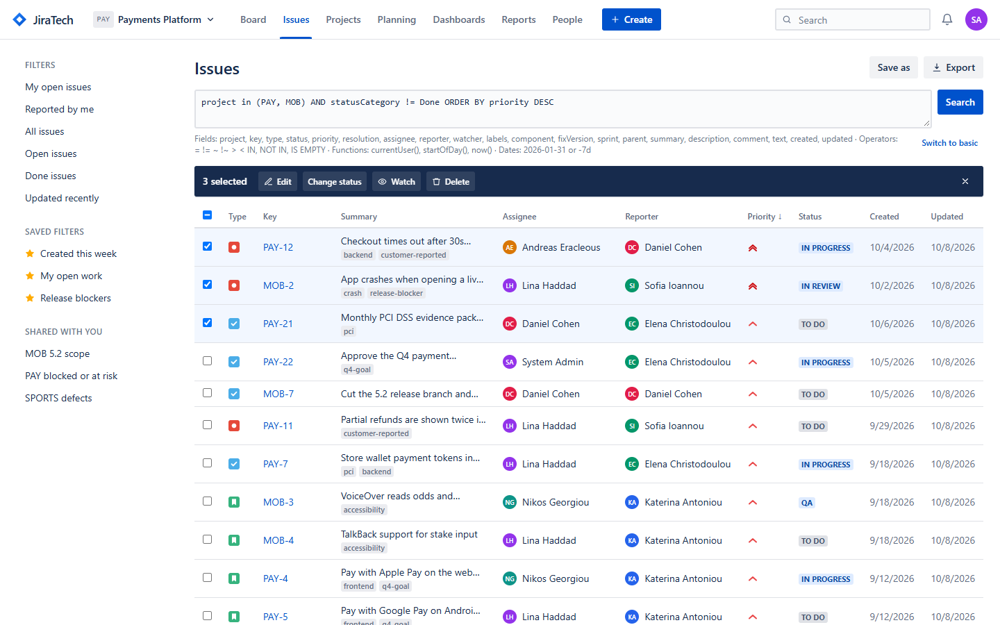

| Action | What it does |
|---|---|
| **Edit** | Set assignee, priority, labels, components or fix versions |
| **Change status** | Move to a status (asks for a resolution when moving to Done) |
| **Watch** | Start watching all selected issues |
| **Delete** | Delete the selected issues |

Every issue is checked individually against permissions and the workflow; anything that can't be changed is listed afterwards with the reason. Untick *Send notifications* for quiet clean-ups.

---

## 8. Issue detail

Open any issue at `/browse/KEY-123` (from the board, search, a link or a notification).

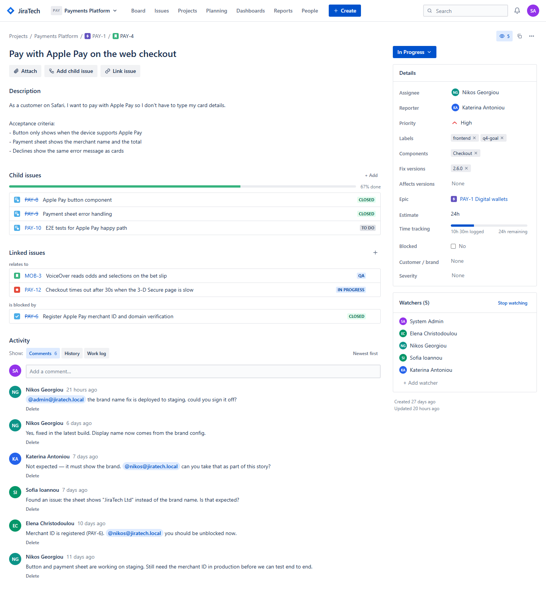

**Header** — breadcrumbs (project / epic / issue), watch button with watcher count, copy link, and a **•••** menu (Log time, Create sub-task, Link issue, Copy link, Delete).

**Main column**
- **Attach / Add child issue / Link issue** quick actions. Attachments can be downloaded and deleted.
- **Description** — rich text, edited in place.
- **Child issues** — list with statuses and a progress bar (% of children done).
- **Linked issues** — grouped by link type: *blocks / is blocked by / depends on / relates to*. Links can cross projects; add with type-ahead search, remove from the list.
- **Activity** — three tabs:
  - **Comments** — add, edit and delete; supports rich text and `@mentions`.
  - **History** — every field change, transition, link and attachment, with old → new values.
  - **Work log** — time logged by each person with a note.

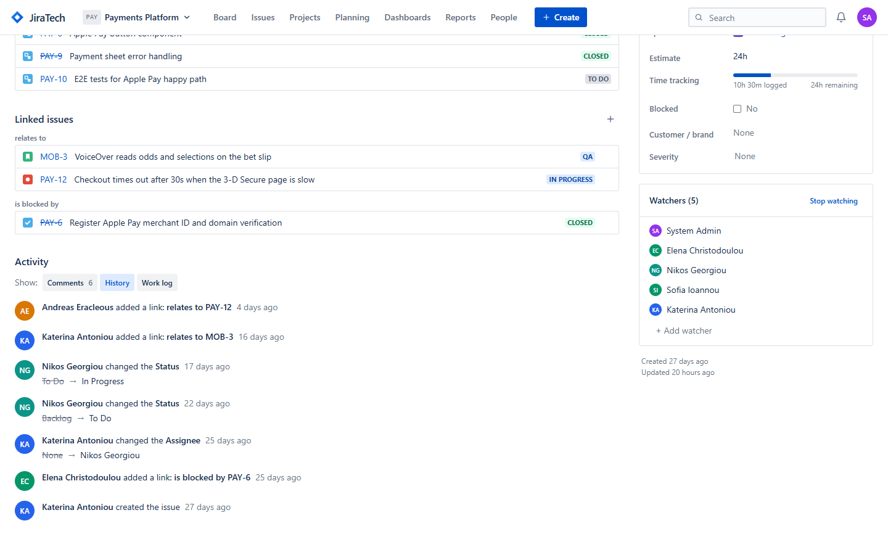

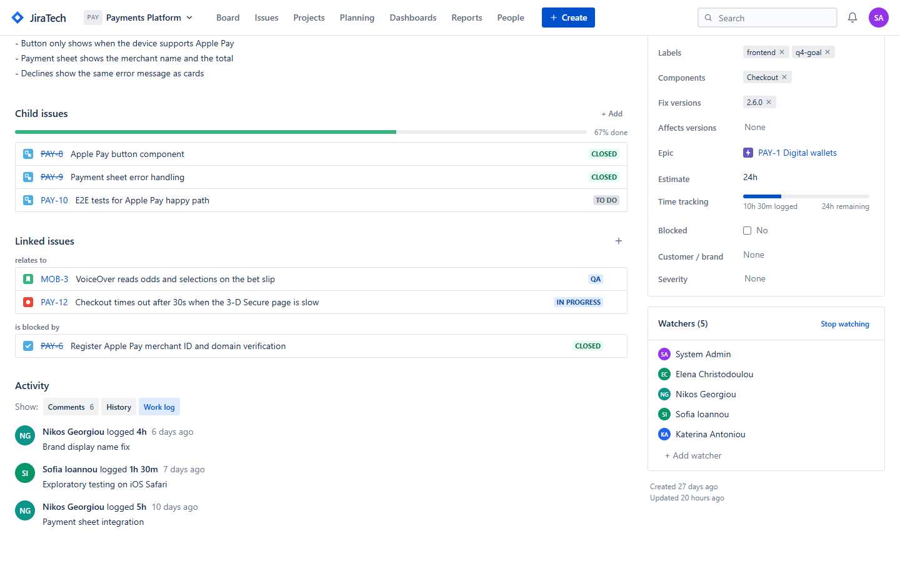

**Side panel**
- **Status button** — shows the current status; the dropdown lists only transitions the workflow allows (including *Re-open* from Done). Moving to Done asks for a resolution.
- **Details** — Assignee, Reporter, Priority, Labels, Components, Fix / Affects versions, Epic, Estimate, **Time tracking** (logged vs. remaining bar), **Blocked** flag, plus the project's **custom fields**. All fields edit in place.
- **Watchers** — list, *Watch / Stop watching*, *Add watcher*.
- Created / updated timestamps.

Opening an issue marks its notifications as read. Deleting an issue removes its comments, history, links, work logs and attachments; issues with children must have them moved or deleted first.

---

## 9. SPORTS features on an issue

In the SPORTS project, issues carry extra fields and actions.

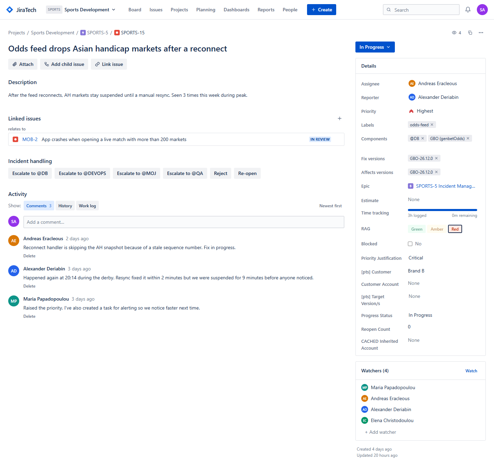

**RAG status** — Green / Amber / Red selector. Amber and red issues appear under *At risk or delayed* on the dashboard.

**SPORTS custom fields** — Priority Justification (YBET / Critical / Standard), [pts] Customer, Customer Account, [pts] Target Version/s, Progress Status, Reopen Count (maintained automatically), CACHED Inherited Account. Projects can define their own custom fields (text, number, select, version).

**Incident handling** (Defects and Tasks) — the *Incident handling* section offers:

| Action | Effect |
|---|---|
| **Escalate to @TEAM** | Adds that team component to the issue |
| **De-escalate** | Removes a team component (API) |
| **Refuse** | The current team hands the issue back (removes its component) |
| **Reject** | Closes the issue with resolution *Rejected* |
| **Re-open** | Moves it back to In Progress and increments *Reopen Count* |

Every action is logged as an escalation event, and the latest ones appear under *Recent escalations* on the dashboard.

**Release epics** — a Release Epic groups the release candidates (RC builds), regression test runs and deployments for one release:

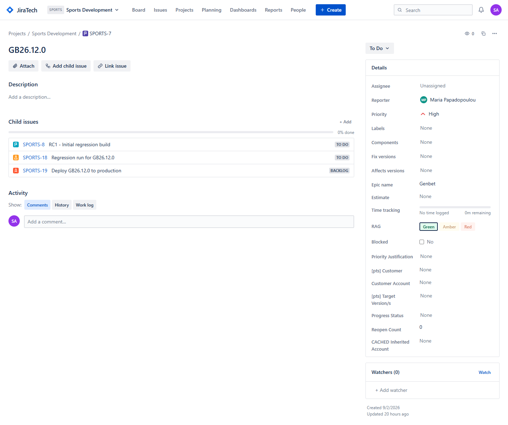

---

## 10. Projects

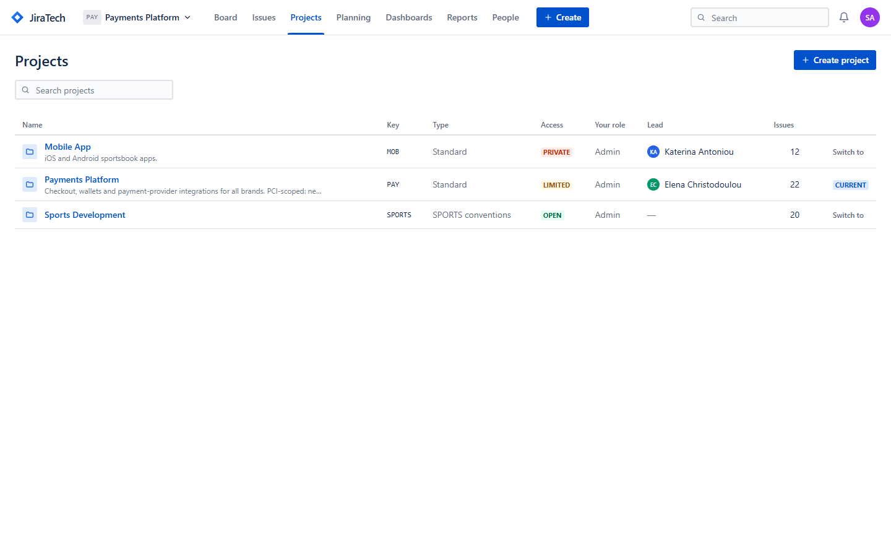

Lists every project you can see, with key, type (Standard / SPORTS conventions), general access (Open / Limited / Private), your role, lead and issue count. **Switch to** makes a project current; the current one is marked **CURRENT**. Search narrows the list.

**Create project** (only people with the global role Admin, Project Manager, Program Manager or Product Manager):

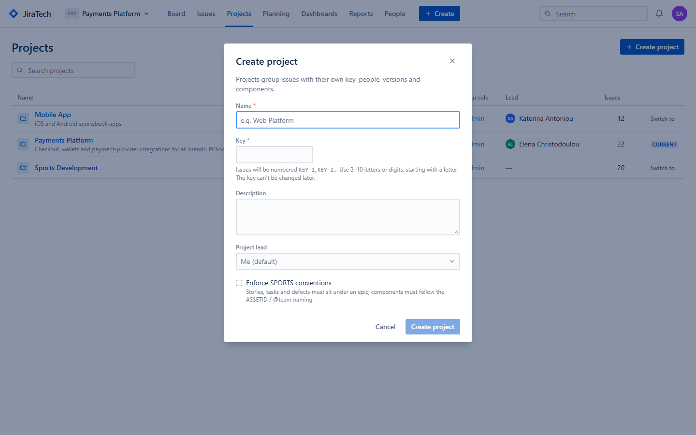

Name, Key (2–10 letters/digits, starting with a letter; can't be changed later), Description, Project lead, and the *Enforce SPORTS conventions* checkbox.

---

## 11. Project settings

Click a project name to open its page. Administrators see edit controls; everyone else sees a read-only view.

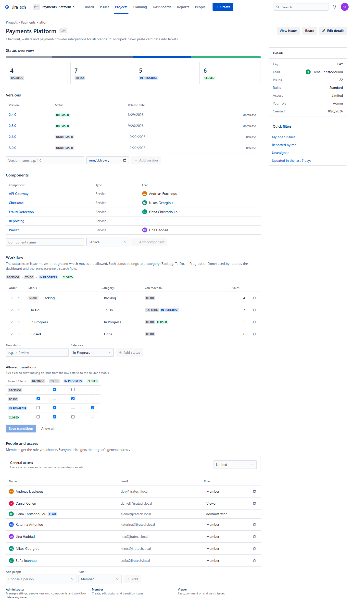

| Section | Contents |
|---|---|
| **Header** | Name, key, description; *View issues*, *Board*, *Edit details* (name, description, lead) |
| **Status overview** | Bar and counts per status category; each count links to a filtered search |
| **Versions** | Name, released / unreleased, release date; *Release* / *Unrelease*; add a version |
| **Components** | Name, type (Service, Team, Release train), lead; add a component (SPORTS naming rules apply in SPORTS projects) |
| **Workflow** | Statuses in order with category, allowed next statuses and issue count. Add, rename, recategorise, reorder and delete statuses. The **Allowed transitions** matrix sets which moves are permitted (*Allow all* for a free workflow) |
| **People and access** | General access level, members with their project role, add/remove people |
| **Details** (side) | Key, lead, issue count, rules, access, your role, created date |
| **Quick filters** (side) | My open issues, Reported by me, Unassigned, Updated in the last 7 days |

---

## 12. Planning (program increments)

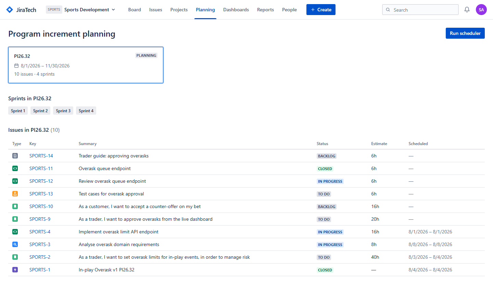

- **PI cards** — each program increment with status (Planning / Active / Completed), date range, issue and sprint counts. Click to select.
- **Sprints** in the selected PI.
- **Issues in the PI** — type, key, summary, status, estimate and scheduled dates.
- **Run scheduler** — orders the PI's issues by priority and type, respects *depends on* links (an issue starts after what it depends on), and fits them into team capacity (by component; 40 h default per team; missing estimates count as 8 h). It writes scheduled start/end dates and shows a summary: *Scheduled*, *Unscheduled*, and *Constraint violations* (e.g. "insufficient capacity for team @DB").

> Running the scheduler updates the scheduled dates on the PI's issues.

---

## 13. Dashboard

Plan-progress dashboard for the current project.

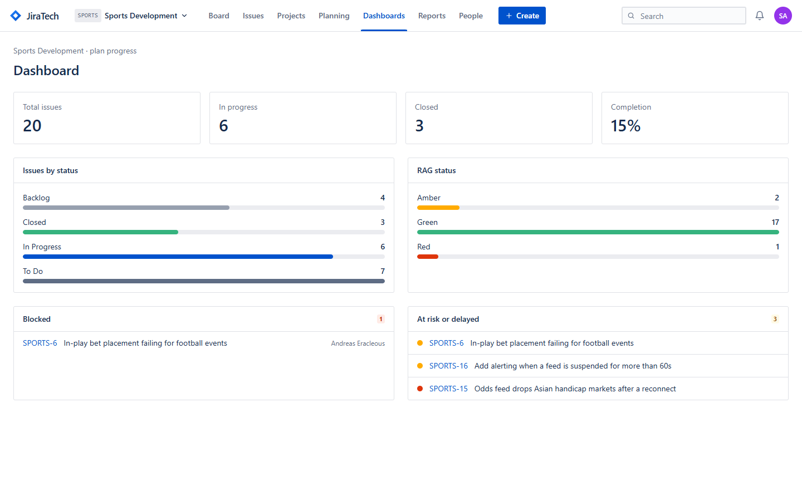

- **Totals** — total issues, in progress, closed, completion %.
- **Issues by status** and **RAG status** bar charts.
- **Blocked** — issues flagged as blocked, with assignee.
- **At risk or delayed** — amber and red issues.
- **Recent escalations** — latest incident actions (shown when there are any).

---

## 14. Reports

Four management reports for the current project over a chosen period (From / To dates, or *Last 3 / 6 / 12 months*). **Download PDF** produces an A4 PDF with all four reports, each starting on a new page.

**Status dashboard** — Monthly Project Status Report: project, report date, overall status, % complete; donuts for issue status, type and priority; pending items by type; closed by last assignee; closed per month (stories, bugs, tasks) over 12 months.

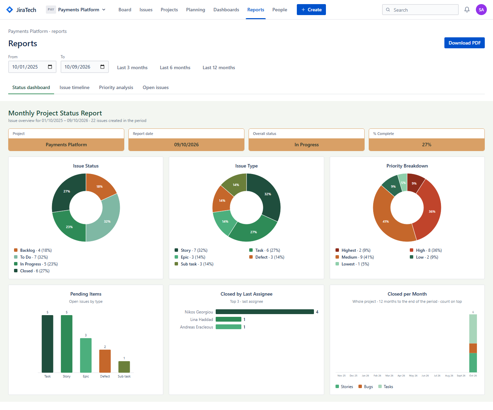

**Issue timeline** — the 10 longest-open bugs, stories and epics, drawn as bars from creation date to today, coloured by status category.

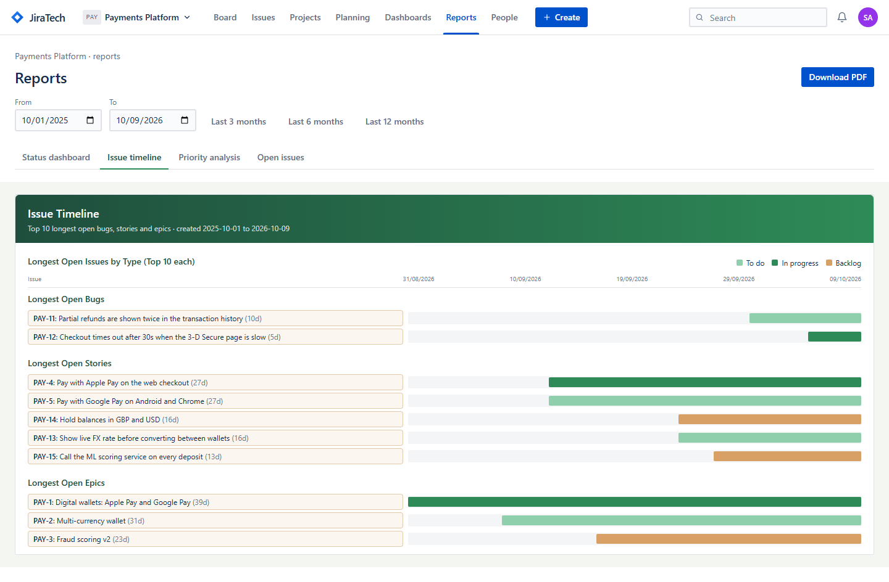

**Priority analysis** — open issues by priority, plus the full list of open Highest and High issues.

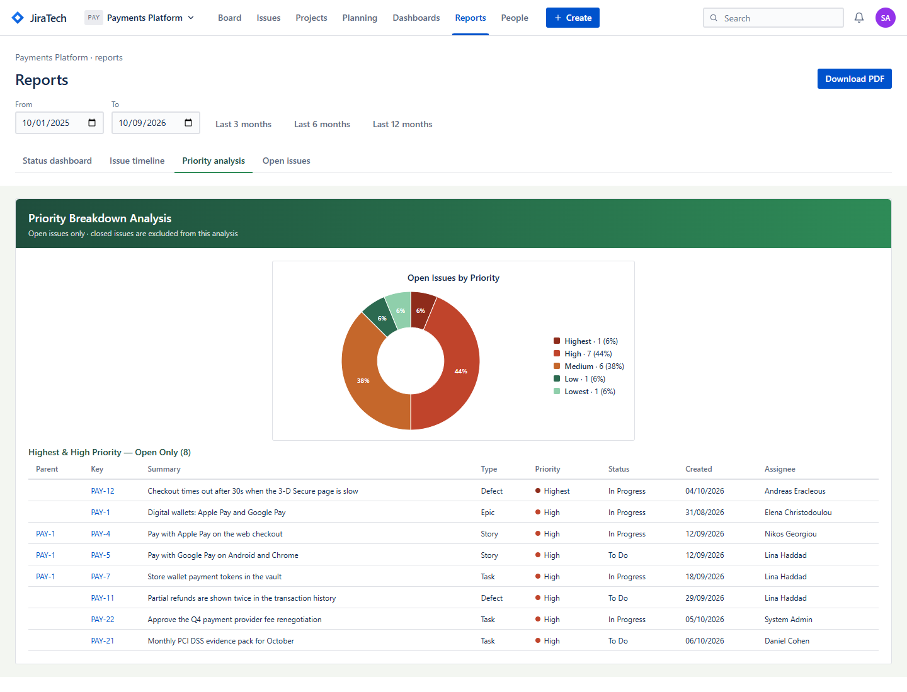

**Open issues** — every open issue in the period with key, summary, type, status, priority, assignee and age.

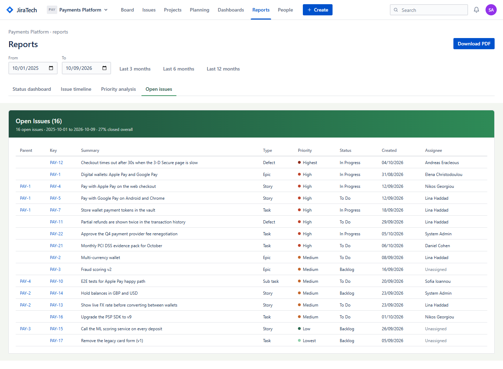

---

## 15. People

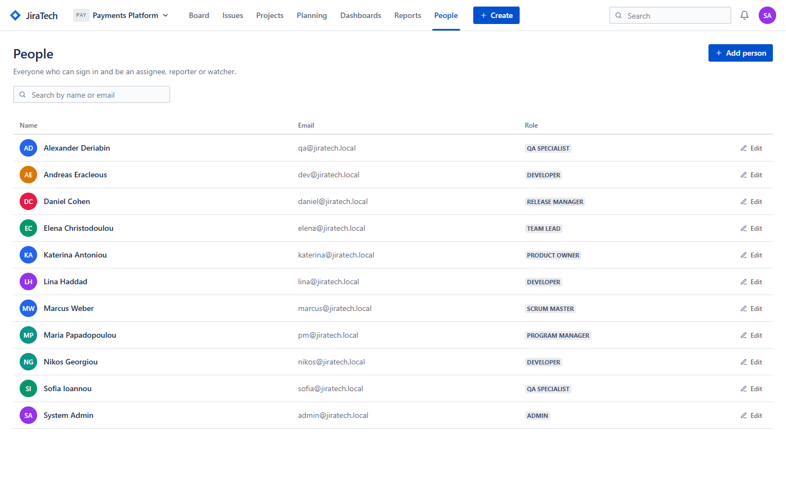

Everyone who can sign in and be an assignee, reporter or watcher. Search by name or email. Administrators can **Add person** (full name, email, password, role) and **Edit** people (including resetting the password).

Global roles: Admin, Developer, Merge Master, Product Manager, Product Owner, Program Manager, Project Manager, QA Specialist, Release Manager, Scrum Master, Team Lead. **Admin** administers every project and manages people; **Project / Program / Product Manager** can also create projects; the other roles describe the person's job. What someone can do inside a project is set by their **project role** (see section 17).

---

## 16. Notifications and email

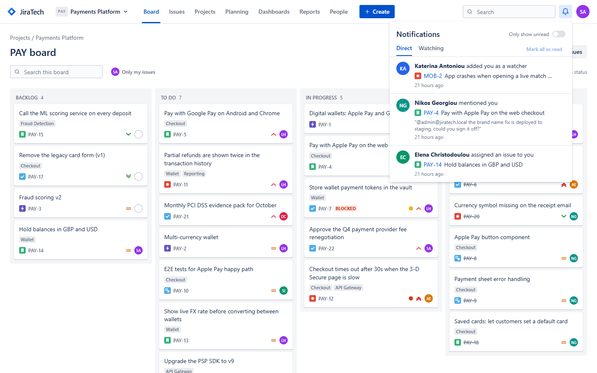

| You get… | When |
|---|---|
| **Assigned** | Someone assigns an issue to you |
| **Mentioned** | Someone `@mentions` you in a comment or description |
| **Watching** | Someone adds you as a watcher |
| **Commented / Status changed / Updated / Deleted** | An issue you reported, are assigned to or watch changes |

- **Direct** tab: assignments, mentions, watcher invitations. **Watching** tab: everything.
- *Only show unread*, *Mark all as read*, and per-item read/unread.
- You're never notified about your own actions; each change produces at most one notification per person.
- Each notification is also emailed unless you switch off *Email notifications* in the account menu. Without an SMTP server configured, emails are written as `.eml` files to `backend/mail-outbox/`.

---

## 17. Permissions reference

Each project has **members** with a role, plus **general access** for everyone else.

| Project role | Can |
|---|---|
| **Administrator** | Everything below, plus project settings, people, versions, components, custom fields, workflow, and deleting any issue |
| **Member** | Create, edit, assign, link and transition issues; log work; delete issues they reported |
| **Viewer** | Browse, comment and watch |

| General access | Everyone who isn't a member… |
|---|---|
| **Open** | is a Member |
| **Limited** | is a Viewer |
| **Private** | can't see the project at all |

Global admins and the project lead always administer a project. Search, quick search, boards, links and notifications only include what you can see.

---

## 18. JQL reference

```
project = SPORTS AND status != CLOSED ORDER BY priority DESC
assignee = currentUser() AND type IN (Story, Bug)
text ~ "login" AND updated >= -7d
labels IS EMPTY AND (priority = Highest OR priority = High)
```

| | |
|---|---|
| **Fields** | project, key, type, status, statusCategory, priority, resolution, assignee, reporter, watcher, labels, component, fixVersion, affectedVersion, sprint, parent, epicName, summary, description, comment, text, created, updated, blocked |
| **Operators** | `=  !=  ~  !~  >  >=  <  <=  IN  NOT IN  IS [NOT] EMPTY`, combined with `AND / OR / NOT` and parentheses |
| **Functions** | `currentUser()`, `now()`, `startOfDay()`, `startOfWeek()`, `startOfMonth()` |
| **Dates** | `2026-01-31`, `"2026-01-31 14:00"`, or relative `-7d`, `-2w`, `-4h` |
| **Sorting** | `ORDER BY field ASC|DESC` |

---

## 19. Capabilities available through the API only

These backend features exist but have no screen yet; they can be called through the REST API:

| Feature | Endpoint |
|---|---|
| List release candidates of a Release Epic | `GET /api/releases/:epicId/candidates` |
| Create a release candidate | `POST /api/releases/:epicId/candidates` |
| Sign off the Golden Master (closes the RC and copies its fix versions to the Release Epic) | `POST /api/releases/candidates/:id/sign-off` |
| Generate release notes (delivered features and bug fixes for the epic's fix versions) | `GET /api/releases/:epicId/notes` |
| De-escalate / Refuse an incident | `POST /api/incidents/:id/escalate` with `action` |

The full endpoint list is in the project [README](../README.md#api).

---

## 20. Screen index

| # | Screen | Route | Screenshot |
|---|---|---|---|
| 1 | Login | `/login` | [01-login](screenshots/01-login.png) |
| 2 | Board | `/` | [02-board](screenshots/02-board.png), [19-board-sports](screenshots/19-board-sports.png) |
| 3 | Quick search | header | [03-quick-search](screenshots/03-quick-search.png) |
| 4 | Notifications | header | [04-notifications](screenshots/04-notifications.png) |
| 5 | Account menu | header | [05-account-menu](screenshots/05-account-menu.png) |
| 6 | Project switcher | header | [06-project-switcher](screenshots/06-project-switcher.png) |
| 7 | Create issue | dialog, `/issues/new` | [07-create-issue](screenshots/07-create-issue.png) |
| 8 | Issues — basic | `/search` | [08-search-basic](screenshots/08-search-basic.png) |
| 9 | Issues — JQL | `/search?jql=…` | [09-search-jql](screenshots/09-search-jql.png) |
| 10 | Bulk change | `/search` | [10-bulk-change](screenshots/10-bulk-change.png) |
| 11 | Issue detail | `/browse/:key` | [11-issue-detail](screenshots/11-issue-detail.png), [12-issue-history](screenshots/12-issue-history.png), [13-issue-worklog](screenshots/13-issue-worklog.png) |
| 12 | SPORTS issue | `/browse/:key` | [14-issue-incident](screenshots/14-issue-incident.png), [15-issue-release-epic](screenshots/15-issue-release-epic.png) |
| 13 | Projects | `/projects` | [16-projects](screenshots/16-projects.png), [17-create-project](screenshots/17-create-project.png) |
| 14 | Project page | `/projects/:key` | [18-project-page](screenshots/18-project-page.png) |
| 15 | Planning | `/planning` | [20-planning](screenshots/20-planning.png) |
| 16 | Dashboard | `/dashboard` | [21-dashboard](screenshots/21-dashboard.png) |
| 17 | Reports | `/reports` | [22](screenshots/22-reports-status.png) · [23](screenshots/23-reports-timeline.png) · [24](screenshots/24-reports-priority.png) · [25](screenshots/25-reports-open.png) |
| 18 | People | `/users` | [26-people](screenshots/26-people.png) |
| 19 | Page not found | any unknown route | [27-not-found](screenshots/27-not-found.png) |
